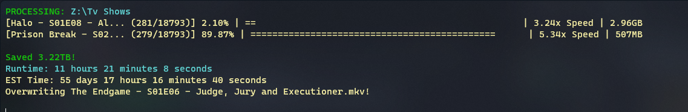

# Dependencies

1. `Chase.FFmpeg` - For handling ffmpeg commands
2. `Chase.FFmpeg.Downloader` - To download the latest version of ffmpeg
3. `Chase.FFmpeg.Extras` - Handles getting a list of all media files

# Interface



# Execution
```bash
# Start in current directory.
./bpf.exe
# Start in specified directory.
./bpf.exe "/path/to/files/even with a space/"
```
# Shortcuts
1. **`Ctrl` + `O`** - *Open workspace directory*
1. **`Ctrl` + `S`** - *Open settings file*
1. **`Ctrl` + `P`** - *Safely stops the program. The current process will finish and then the program will exit!*  

# Paths
Workspace Config:   
`%localappdata%/LFInteractive/Batch Process FFmpeg/{start directory}/settings.json`  
Where current files are being processed:   
`%localappdata%/LFInteractive/Batch Process FFmpeg/{start directory}/tmp`  
FFmpeg  
`%localappdata%/LFInteractive/Batch Process FFmpeg/ffmpeg`  
Example:   
`%localappdata%/LFInteractive/Batch Process FFmpeg/path_to_files_even_with_a_space/`  
